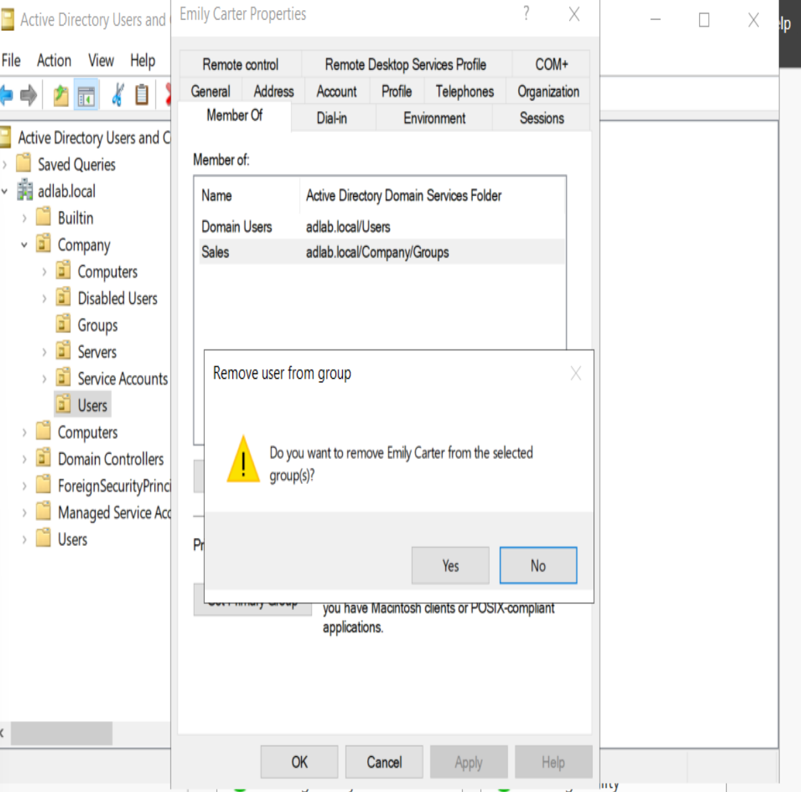
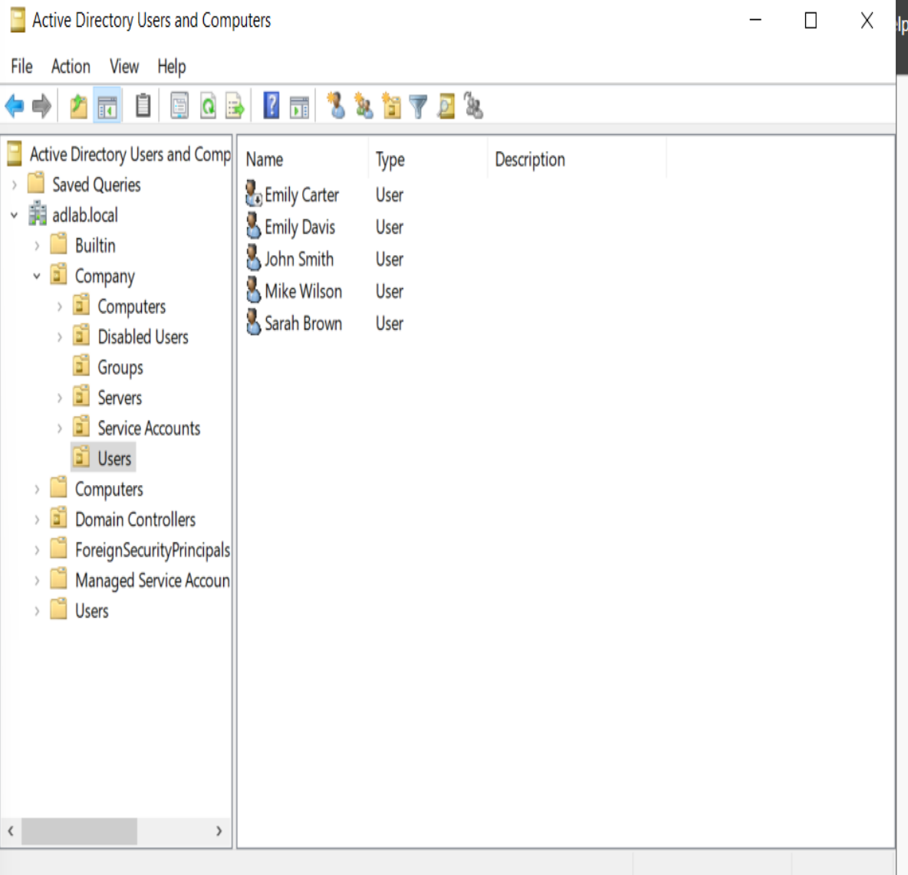
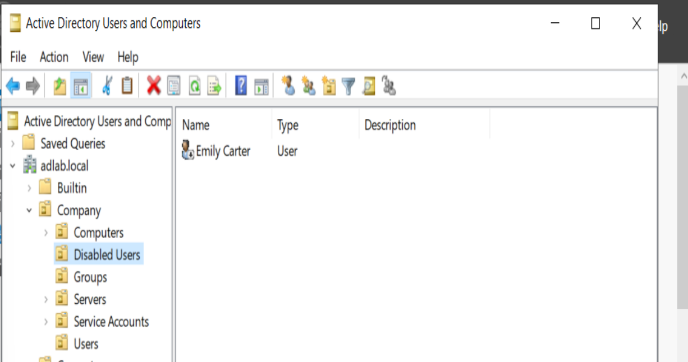
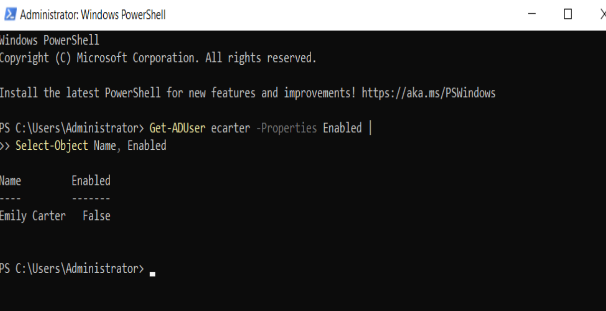
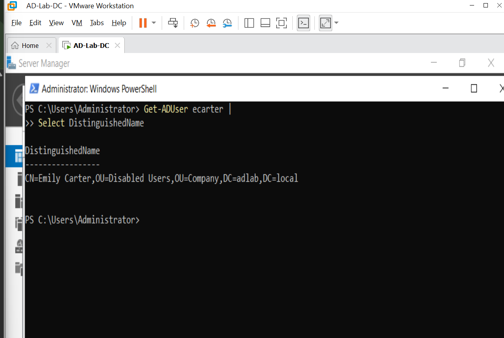

# HD-004 — User Offboarding

## Objective

Simulate a common Help Desk request by securely offboarding a departing employee. Demonstrate how to remove unnecessary security group memberships, disable the Active Directory account, move it to a dedicated Disabled Users Organizational Unit (OU), and verify the changes using both Active Directory Users and Computers (ADUC) and PowerShell.

---

# Ticket Information

**Ticket ID:** HD-004

**Priority:** Medium

**Category:** User Administration

**Status:** Completed

---

## Scenario

Human Resources notified the Help Desk that employee **Emily Carter (ecarter)** had left the organization.

Following company offboarding procedures, the account needed to be secured while remaining available for auditing and future administrative review.

The required tasks were to:

- Remove unnecessary security group memberships.
- Disable the Active Directory account.
- Move the account to the **Disabled Users** Organizational Unit.
- Verify the account status.
- Verify the account location.

---

## Environment

| Item | Value |
|------|-------|
| Domain | adlab.local |
| Domain Controller | DC01 |
| Client | CLIENT01 |
| User | Emily Carter (ecarter) |
| Operating System | Windows Server 2022 |
| Management Tools | Active Directory Users and Computers (ADUC), PowerShell |

---

## Investigation

Verified that **Emily Carter** existed within Active Directory.

Reviewed current security group memberships.

Confirmed the account was still enabled and located within the **Users** Organizational Unit.

---

# Resolution

Opened **Active Directory Users and Computers (ADUC)**.

Completed the following actions:

- Removed **Sales** from the user's **Member Of** tab while retaining the default **Domain Users** membership.

### Remove Sales Security Group Membership

The unnecessary **Sales** security group membership was removed as part of securing the departing employee's account.



- Disabled the Active Directory account.

### Disable Active Directory Account

The user account was disabled to prevent further authentication while preserving the account for auditing and administrative review.



- Moved the account into the **Disabled Users** Organizational Unit.

### Move Account to Disabled Users OU

The disabled account was moved from the active Users Organizational Unit into the dedicated **Disabled Users** OU.



Verified the changes using PowerShell.

Confirmed the account status:

```powershell
Get-ADUser ecarter -Properties Enabled |
Select-Object Name, Enabled
```

### Verify Disabled Account Status

PowerShell was used to confirm that the Active Directory account was successfully disabled.



Confirmed the account location:

```powershell
Get-ADUser ecarter |
Select DistinguishedName
```

### Verify Organizational Unit Location

PowerShell was used to verify the account's Distinguished Name and confirm that it was located within the **Disabled Users** Organizational Unit.



---

# Validation

Completed the following validation tests:

- ✅ Sales security group removed
- ✅ Active Directory account disabled
- ✅ Account successfully moved to the Disabled Users OU
- ✅ Account status verified using PowerShell
- ✅ Organizational Unit verified
- ✅ Account preserved for auditing purposes

---

## PowerShell / Commands Used

```powershell
Get-ADUser ecarter -Properties Enabled |
Select-Object Name, Enabled

Get-ADUser ecarter |
Select DistinguishedName
```

---

# Result

✔ Security group membership updated

✔ Active Directory account disabled

✔ Account successfully moved to the Disabled Users OU

✔ Account preserved for future auditing

✔ Offboarding process completed successfully

✔ Ticket resolved successfully

---

# Lessons Learned

- Performed a standard Active Directory user offboarding process.
- Removed unnecessary security group memberships to reduce security risks.
- Disabled the user account instead of deleting it to preserve audit history.
- Organized inactive accounts by moving them to a dedicated Organizational Unit.
- Verified administrative changes using both ADUC and PowerShell.

---