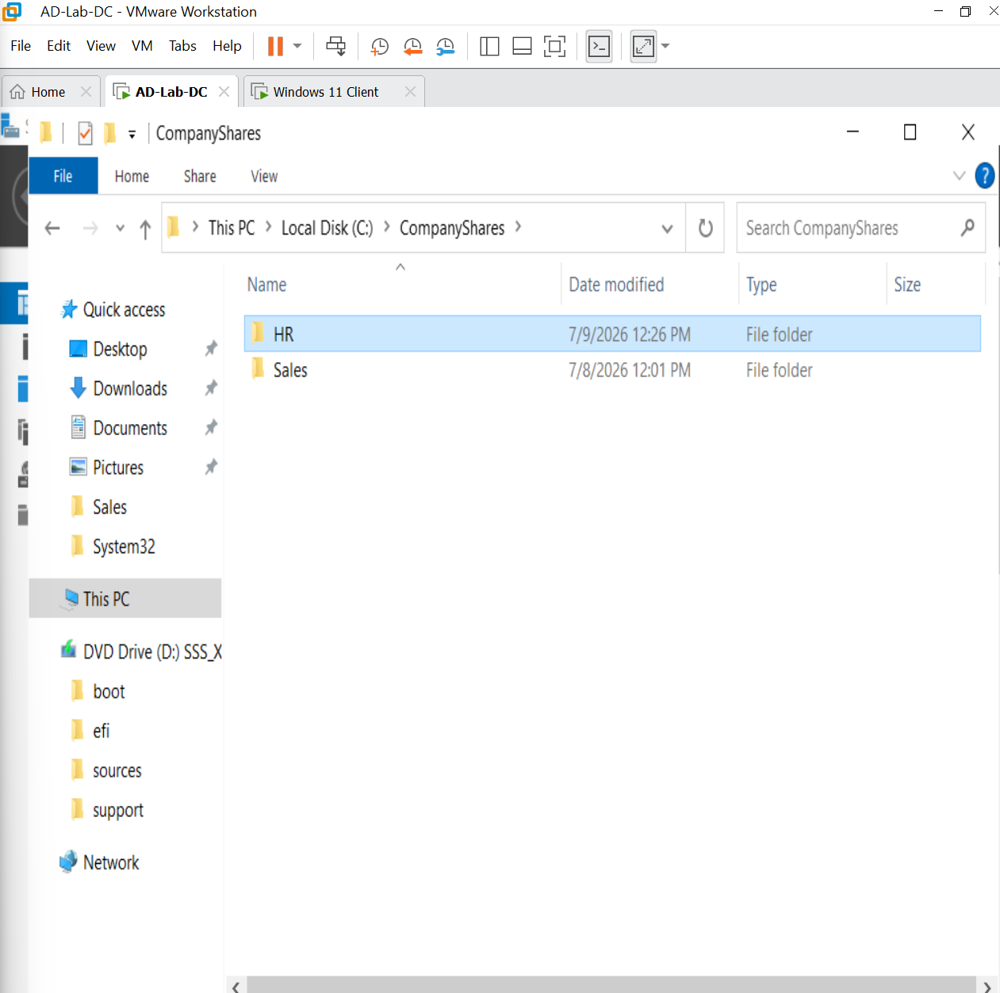
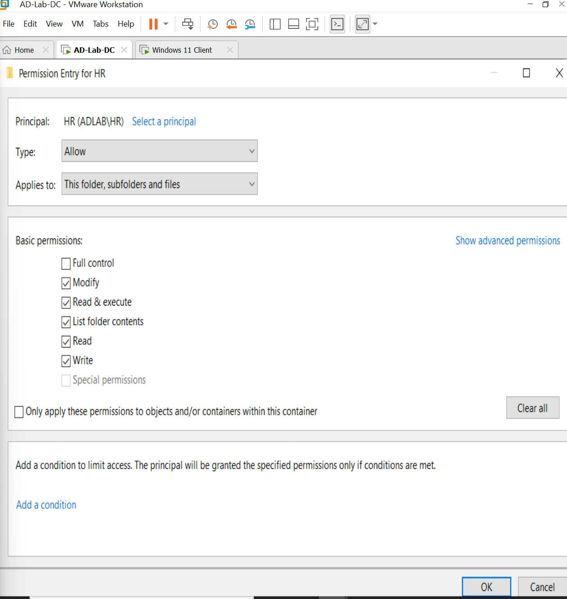
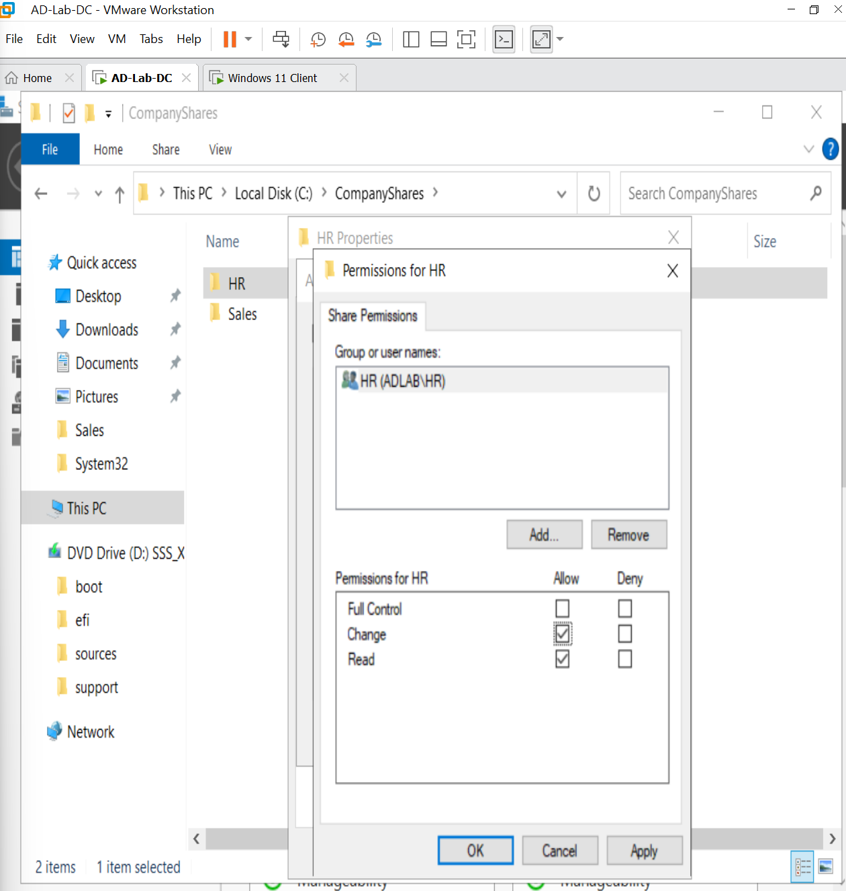
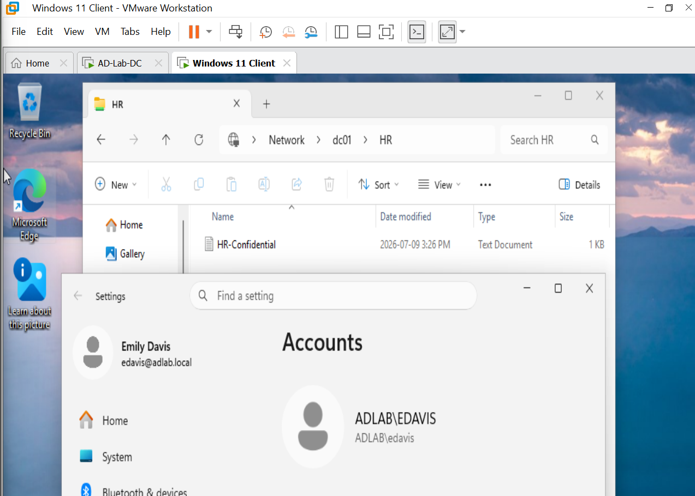
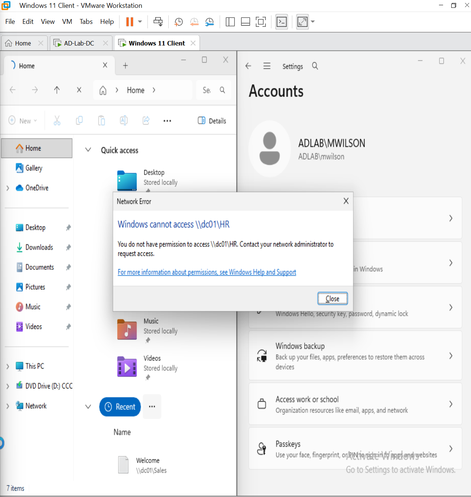
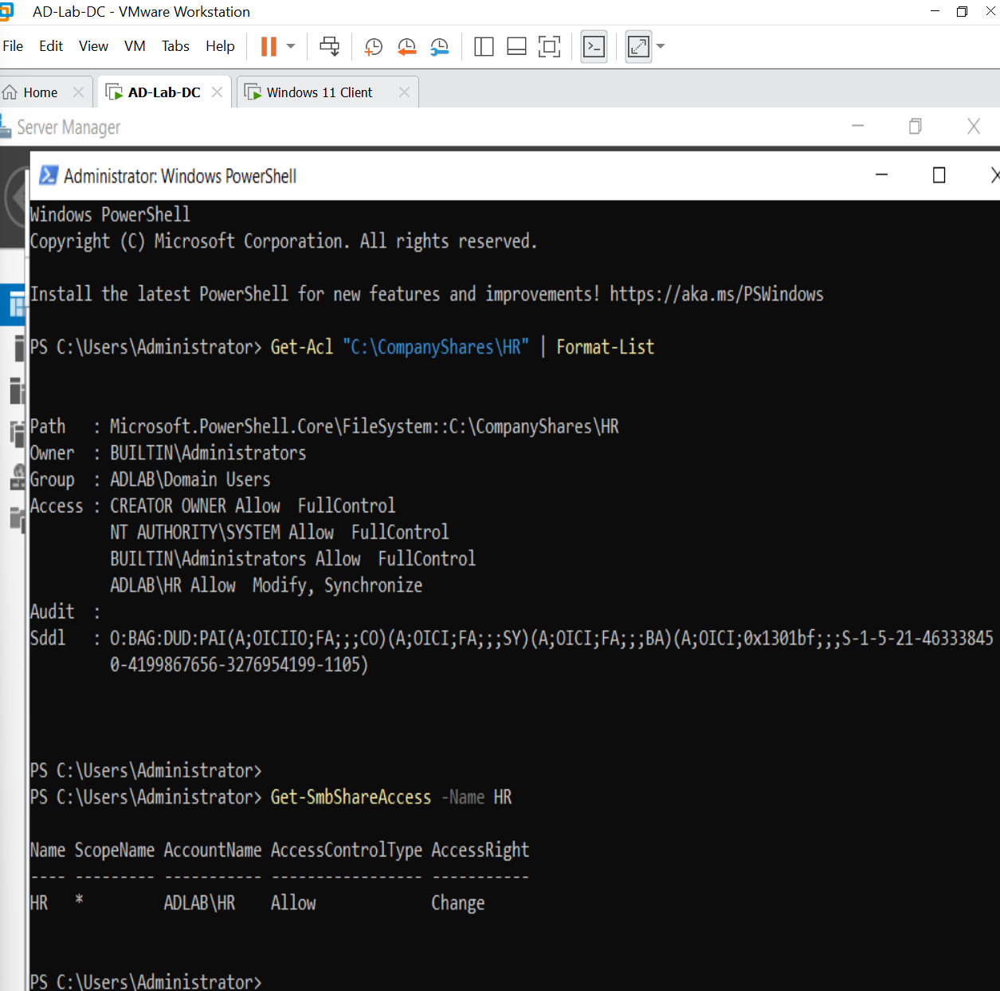

# HD-006 — NTFS Permissions

## Objective

Simulate a common Help Desk request by securing a departmental folder using NTFS permissions. Configure both NTFS and Share permissions so that only members of the Human Resources security group can access confidential files while members of other departments are denied access.

---

## Ticket Information

**Ticket ID:** HD-006

**Priority:** Medium

**Category:** File Services

**Status:** Completed

---

## Scenario

The Human Resources department requested a secure shared folder to store confidential employee documentation.

Requirements:

- Create a secure HR shared folder.
- Allow only members of the HR security group to access the folder.
- Prevent Sales users from accessing the folder.
- Verify permissions from a Windows 11 domain client.

---

## Environment

| Item | Value |
|------|-------|
| Domain | adlab.local |
| Domain Controller | DC01 |
| Client Computer | CLIENT01 |
| Folder Path | C:\CompanyShares\HR |
| Share Name | HR |
| Security Group | HR |

---

## Investigation

Verified the following before configuring permissions:

- The HR security group existed in Active Directory.
- Emily Davis (edavis) was a member of the HR security group.
- Mike Wilson (mwilson) belonged to the Sales department and should not receive access.
- CLIENT01 was successfully joined to the Active Directory domain.

---

## Resolution

Created the following folder:

```text
C:\CompanyShares\HR
```

Created the confidential document:

```text
HR-Confidential.txt
```

### Create the HR Shared Folder

The HR departmental folder and confidential test document were created before configuring access permissions.



Configured NTFS permissions:

- HR → Modify
- Administrators → Full Control
- SYSTEM → Full Control

Disabled permission inheritance and removed unnecessary inherited permissions.

### Configure NTFS Permissions

NTFS permissions were configured to grant the **HR** security group Modify access while maintaining Full Control for Administrators and SYSTEM.



Configured Share Permissions:

- HR → Change
- HR → Read

Removed the default **Everyone** share permission.

### Configure Share Permissions

Share-level permissions were configured for the **HR** security group, and the default **Everyone** permission was removed to restrict network access to authorized users.



Verified access using both graphical tools and PowerShell.

### Verify Authorized HR User Access

The HR share was accessed using an authorized HR user account to confirm that members of the **HR** security group could successfully access the confidential departmental resource.



### Verify Unauthorized Sales User Is Denied

Access was tested using the **Mike Wilson (mwilson)** Sales account to confirm that users outside the HR security group could not access the confidential HR share.



---

## Validation

Completed the following validation tests:

- ✅ HR folder successfully created
- ✅ NTFS permissions configured correctly
- ✅ Share permissions configured correctly
- ✅ Emily Davis successfully accessed the HR share
- ✅ HR-Confidential.txt opened successfully
- ✅ Mike Wilson received an **Access Denied** message
- ✅ PowerShell verified both NTFS and SMB Share permissions

### PowerShell Permission Verification

PowerShell was used to verify both the NTFS access control configuration and SMB share permissions applied to the HR shared folder.



---

## PowerShell / Commands Used

```powershell
Get-Acl "C:\CompanyShares\HR" | Format-List

Get-SmbShareAccess -Name HR
```

---

## Result

✔ Secure HR shared folder successfully deployed

✔ NTFS permissions configured correctly

✔ Share permissions configured correctly

✔ HR users successfully accessed confidential files

✔ Sales users were denied access

✔ PowerShell verification completed successfully

✔ Ticket resolved successfully

---

## Lessons Learned

- NTFS permissions determine what users can do after accessing a folder.
- Share permissions control network access to shared folders.
- Combining Share and NTFS permissions provides layered security.
- Security groups simplify permission management by assigning permissions to groups instead of individual users.
- PowerShell provides a fast method for validating both NTFS permissions and SMB share permissions.

---