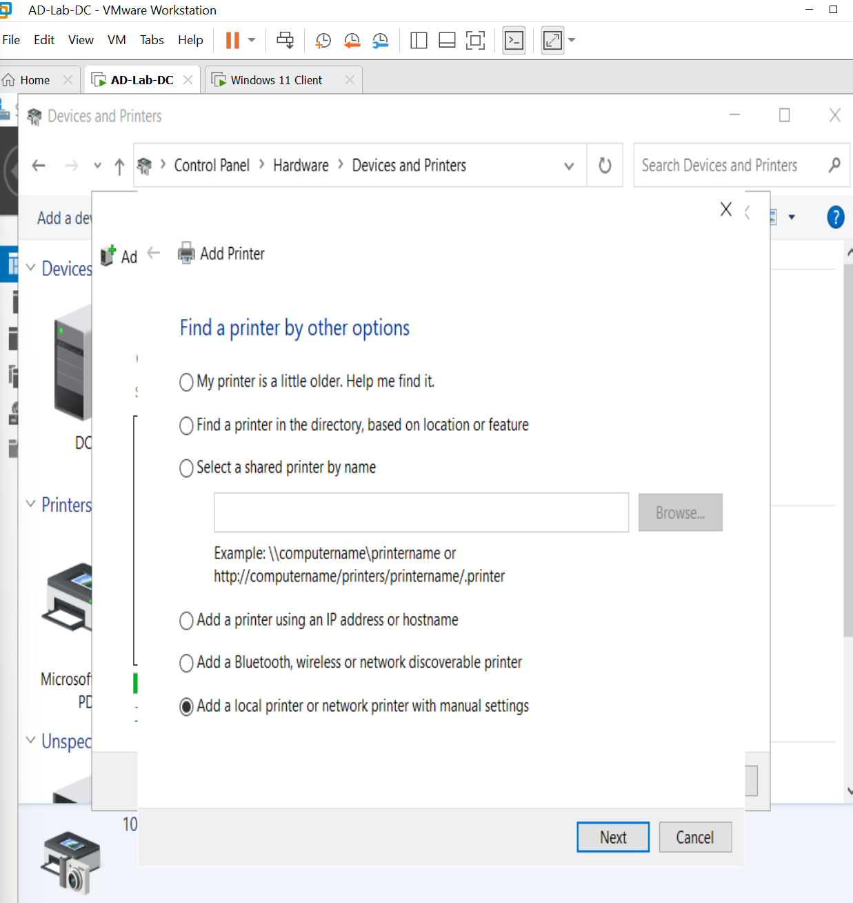
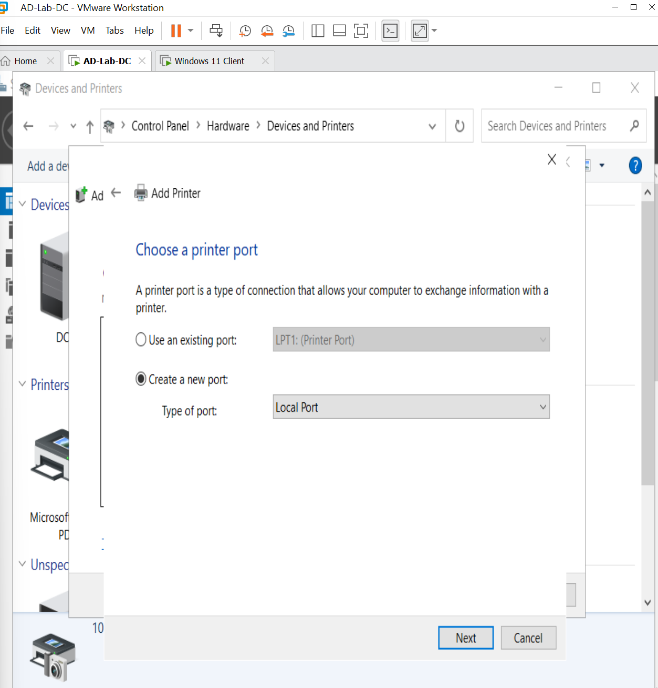
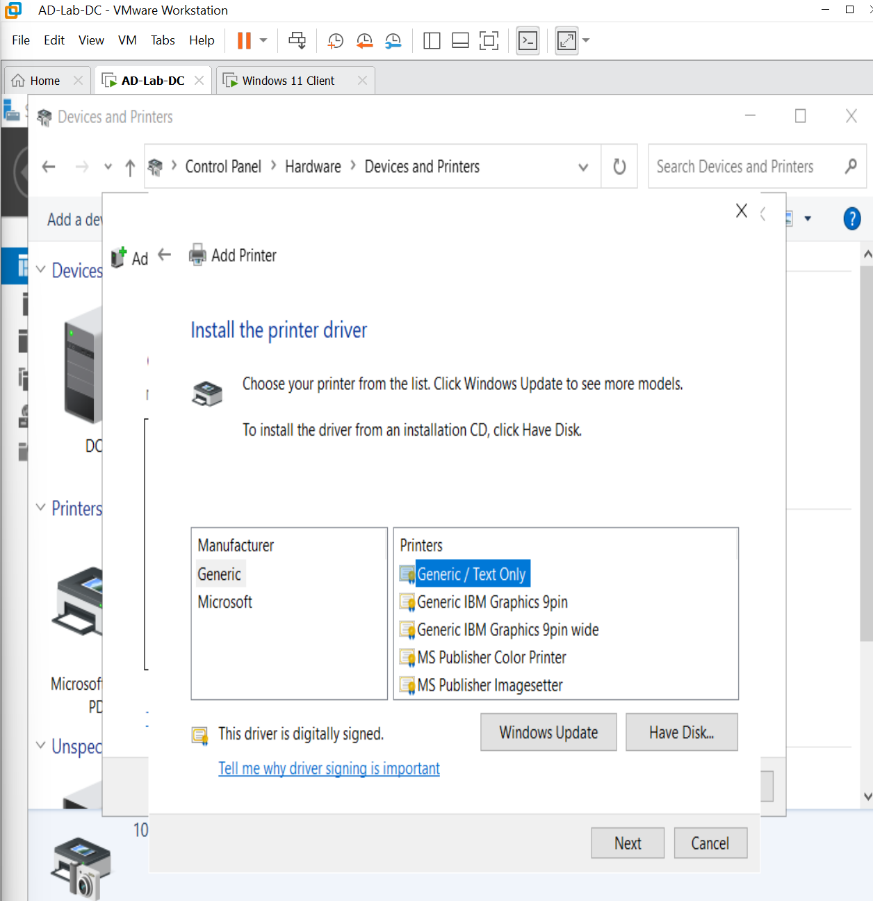
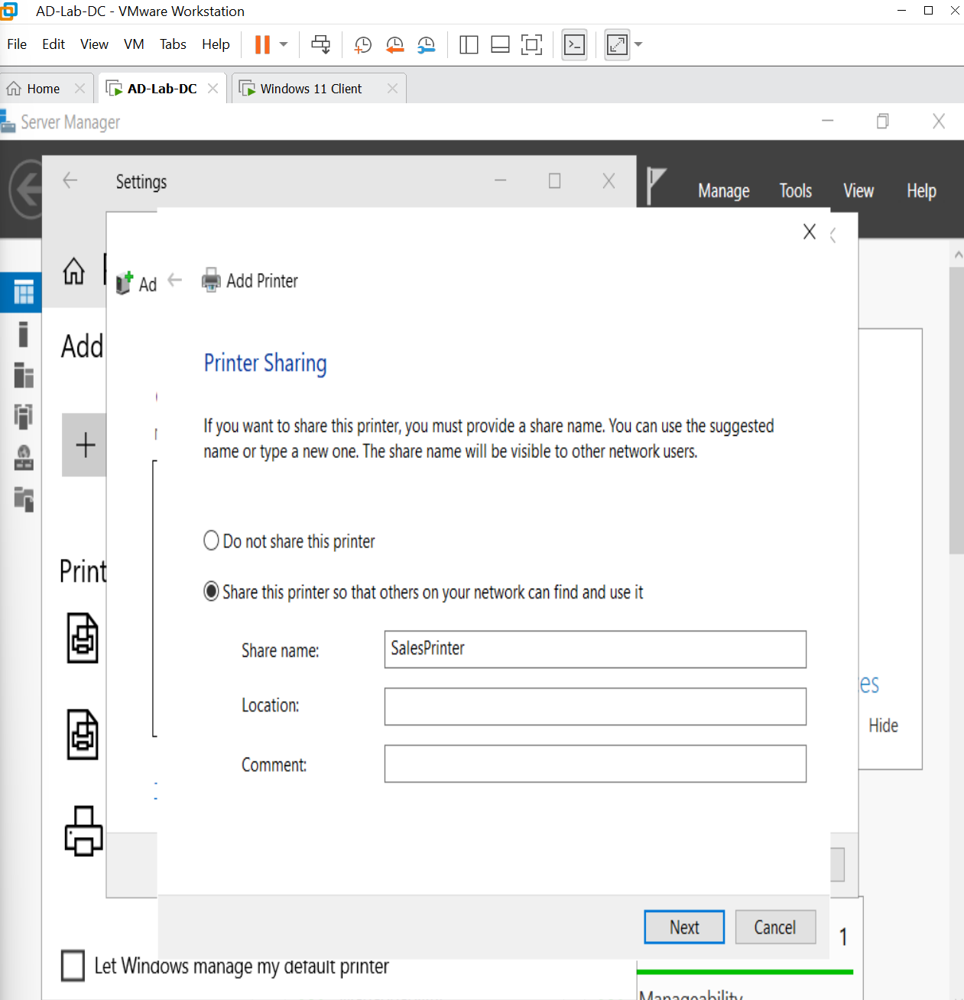
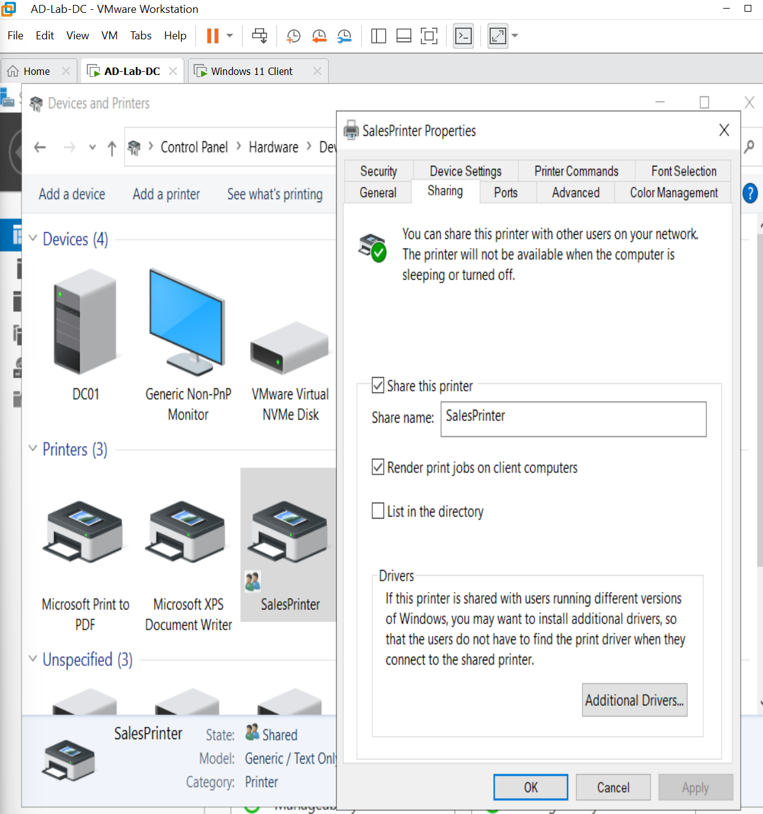
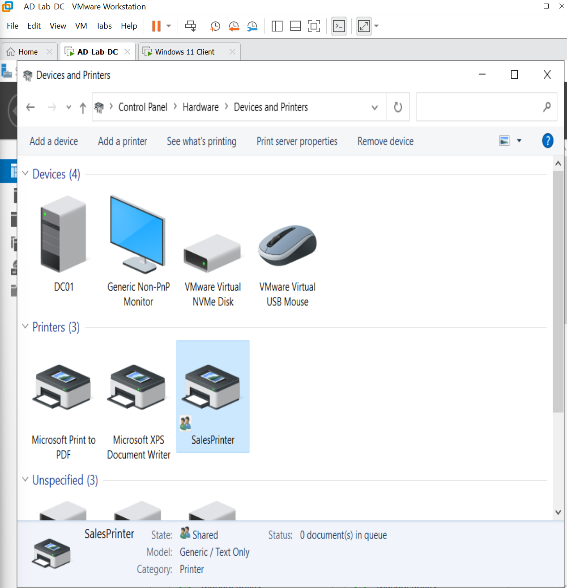
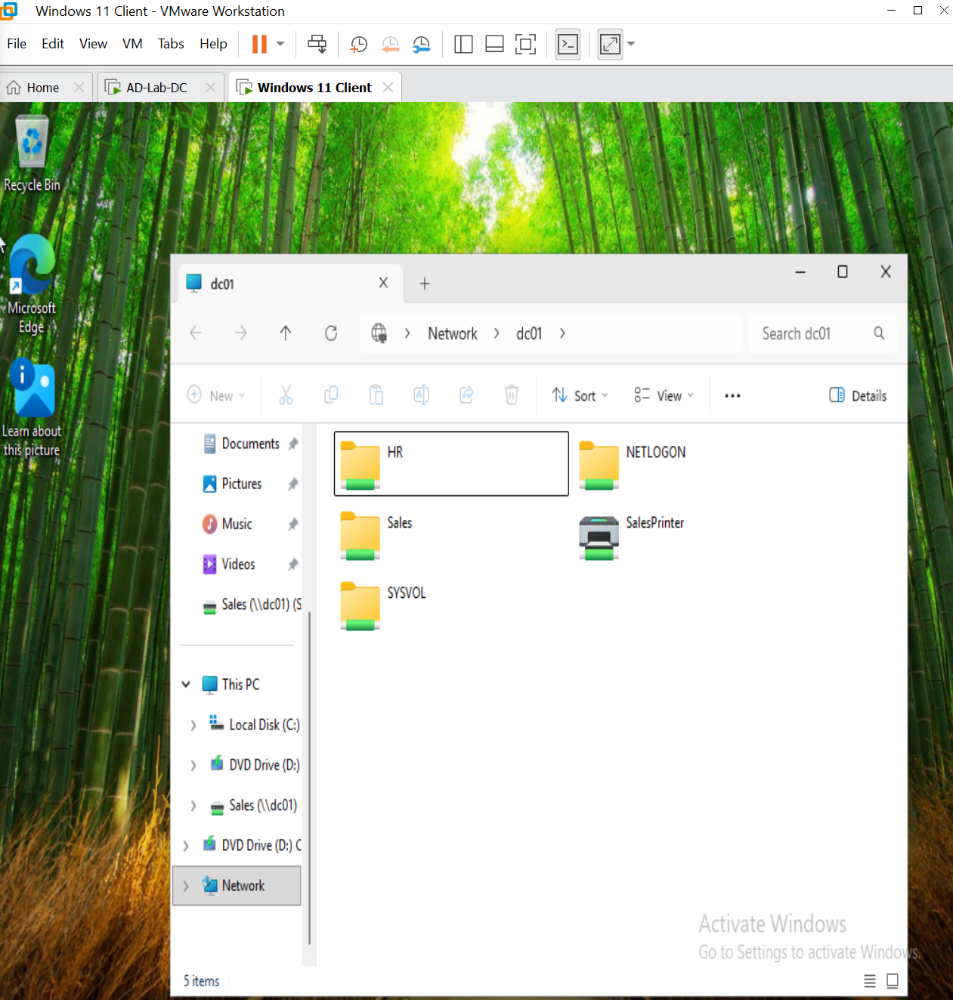
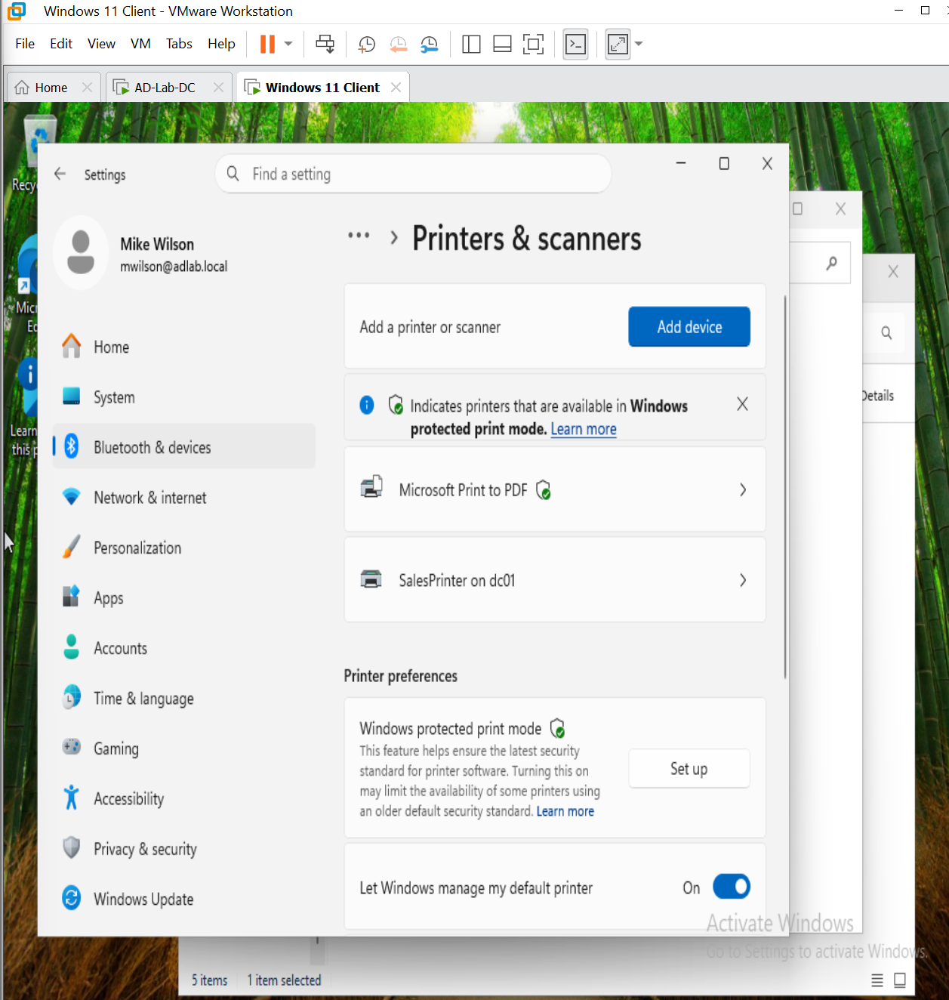
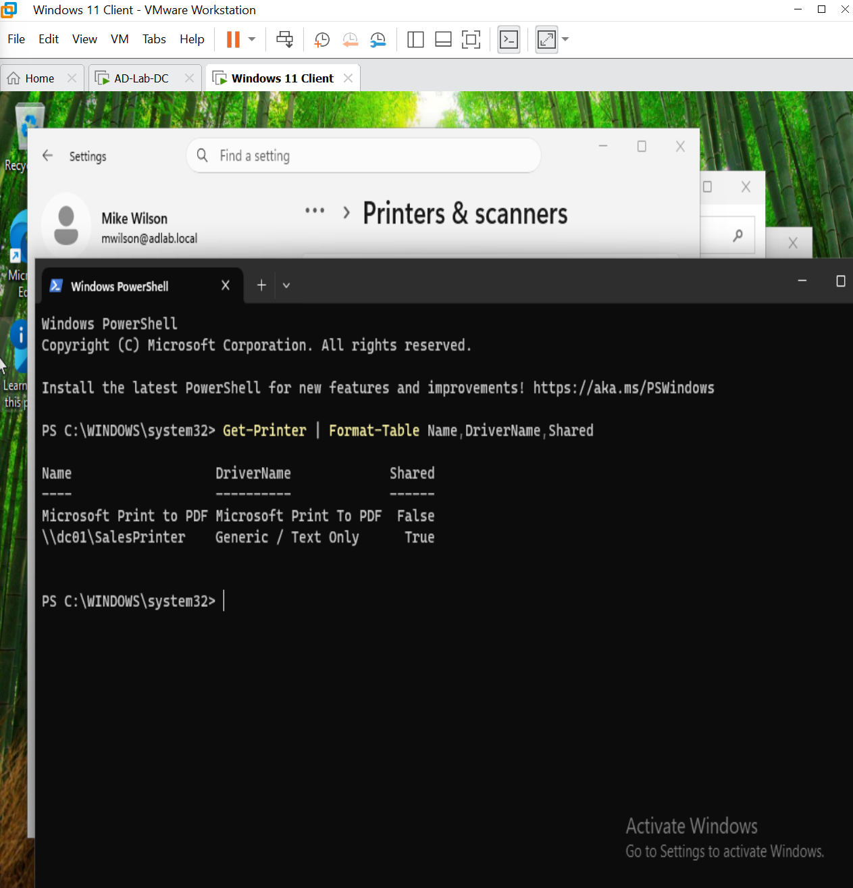

# HD-008 — Printer Deployment

## Objective

Simulate a common Help Desk request by deploying a shared network printer from a Windows Server to a domain-joined Windows client. Demonstrate how to install a printer, configure printer sharing, deploy the printer to a client workstation, and verify the deployment using both graphical tools and PowerShell.

---

## Ticket Information

**Ticket ID:** HD-008

**Priority:** Medium

**Category:** Printer Administration

**Status:** Completed

---

## Scenario

The Sales department requested access to a shared network printer for printing department documents.

The Help Desk was responsible for:

- Installing a shared printer on the print server.
- Configuring printer sharing.
- Deploying the printer to a Windows client.
- Verifying successful installation.
- Confirming printer availability using PowerShell.

---

## Environment

| Item | Value |
|------|-------|
| Domain | adlab.local |
| Domain Controller | DC01 |
| Client | CLIENT01 |
| User | Mike Wilson (mwilson) |
| Printer Name | SalesPrinter |
| Printer Driver | Generic / Text Only |
| Server Operating System | Windows Server 2022 |
| Client Operating System | Windows 11 |

---

## Investigation

Verified the following before deploying the printer:

- The Print Spooler service was running.
- Microsoft Print to PDF could not be shared because Windows Server does not support sharing virtual printers.
- A **Generic / Text Only** printer would provide a realistic simulation of an enterprise network printer deployment.

---

## Resolution

Opened the **Add Printer Wizard** on DC01.

Selected:

```text
Add a local printer or network printer with manual settings
```

### Add Printer Wizard

The Add Printer Wizard was used on DC01 to begin manually installing the simulated network printer.



Created a new **Local Port**.

Configured the following:

```text
Port Name:
C:\PrintQueue
```

### Create Local Printer Port

A new local port was created for the printer using `C:\PrintQueue` as the configured port path.



Selected the printer driver:

```text
Manufacturer:
Generic

Driver:
Generic / Text Only
```

### Select Printer Driver

The **Generic / Text Only** driver was selected to simulate a standard enterprise printer without requiring physical printer hardware.



Named the printer:

```text
SalesPrinter
```

Enabled printer sharing.

Configured the share name:

```text
SalesPrinter
```

### Configure Printer Sharing

The printer was configured as a shared network resource using **SalesPrinter** as the share name.



### Verify Printer Sharing Properties

The printer's sharing properties were reviewed to confirm that sharing was enabled and the **SalesPrinter** share was correctly configured.



Verified the printer appeared in **Devices and Printers**.

### Verify Printer Installation on DC01

The newly configured **SalesPrinter** was verified on the Windows Server after completing the installation and sharing configuration.



Logged into CLIENT01.

Opened:

```text
\\DC01
```

### Verify Shared Printer from CLIENT01

The shared resources available through DC01 were opened from CLIENT01 to confirm that **SalesPrinter** was visible to the domain client.



Connected to the shared printer.

Verified the printer installed successfully on the Windows client.

### Verify Printer Installation on CLIENT01

The shared **SalesPrinter** was successfully connected and installed on CLIENT01.



Validated the deployment using PowerShell.

---

## Validation

Completed the following validation tests:

- ✅ Printer successfully installed on DC01
- ✅ Printer sharing enabled
- ✅ Printer visible from CLIENT01
- ✅ Client successfully connected to the shared printer
- ✅ Printer installed successfully
- ✅ Printer verified using PowerShell
- ✅ Shared printer accessible through **\\DC01**

### PowerShell Verification

PowerShell was used to verify the installed printer, configured driver, and printer sharing status.



---

## PowerShell / Commands Used

```powershell
Get-Printer
```

Displays all printers installed on the system.

```powershell
Get-Printer |
Format-Table Name, DriverName, Shared
```

Displays the printer name, driver, and sharing status.

---

## Result

✔ Network printer successfully deployed

✔ Printer shared across the domain

✔ CLIENT01 successfully connected

✔ Shared printer verified using PowerShell

✔ Users able to access the shared printer

✔ Ticket resolved successfully

---

## Lessons Learned

- Installed and configured a shared network printer on Windows Server 2022.
- Configured printer sharing for domain users.
- Connected a Windows 11 client to a shared network printer.
- Verified printer deployment using PowerShell.
- Learned that **Microsoft Print to PDF** cannot be shared and that the **Generic / Text Only** driver provides an effective enterprise lab simulation.

---