# HD-010 — DHCP Server Installation, Configuration, and Troubleshooting

## Objective

Simulate a common Help Desk incident where a Windows client is unable to obtain a valid IP address because the DHCP Server service is unavailable. Demonstrate the complete lifecycle of installing, configuring, verifying, troubleshooting, and restoring a Windows Server 2022 DHCP environment.

---

## Ticket Information

**Ticket ID:** HD-010

**Priority:** High

**Category:** Network Services

**Status:** Completed

---

## Scenario

A user contacted the Help Desk reporting that their Windows workstation could no longer connect to the network after restarting the computer.

The workstation was configured to obtain an IP address automatically but failed to receive a valid DHCP lease.

The Help Desk was responsible for:

- Investigating the network connectivity issue.
- Verifying DHCP server availability.
- Installing and configuring the DHCP Server role.
- Creating and activating a DHCP scope.
- Restoring DHCP service after simulating a service failure.
- Verifying successful client lease assignment.

---

## Environment

| Item | Value |
|------|-------|
| Domain | adlab.local |
| Domain Controller | DC01 |
| Client | CLIENT01 |
| Server Operating System | Windows Server 2022 |
| Client Operating System | Windows 11 |
| Network | 192.168.66.0/24 |
| DHCP Scope | 192.168.66.100 – 192.168.66.200 |
| DNS Server | 192.168.66.10 |
| Virtualization | VMware Workstation Pro |

---

## Investigation

Verified the client network configuration before troubleshooting.

Confirmed:

- DHCP was enabled.
- Existing IPv4 configuration.
- Correct DNS server configuration.
- Existing DHCP lease information.

### Verify Existing DHCP Configuration

The client's network configuration was reviewed to verify that DHCP was enabled and to establish the existing IPv4, DNS, and lease information.

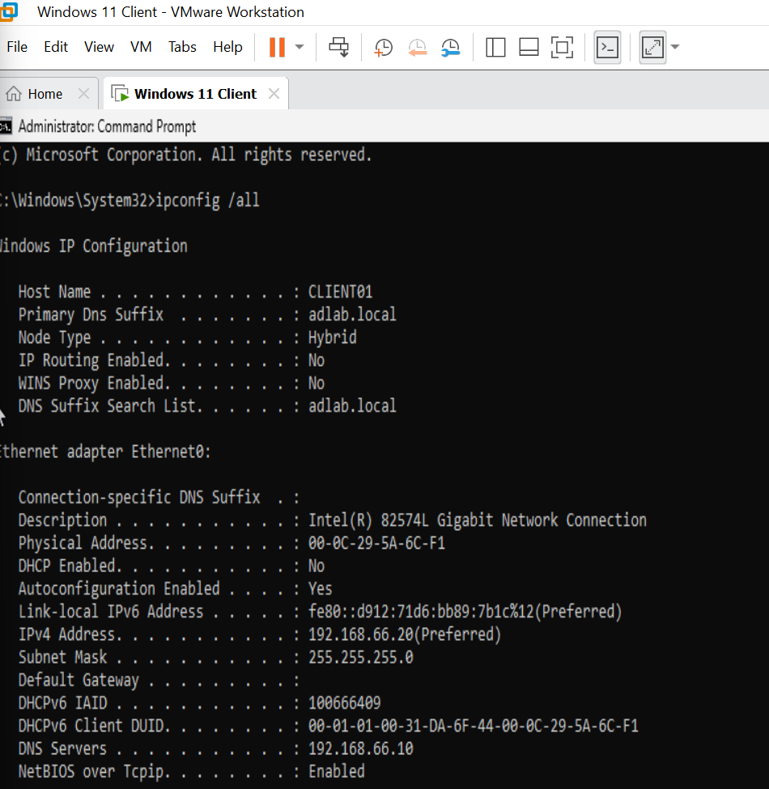

Installed the DHCP Server role using Server Manager.

### Install DHCP Server Role

The DHCP Server role was installed on DC01 through Server Manager.

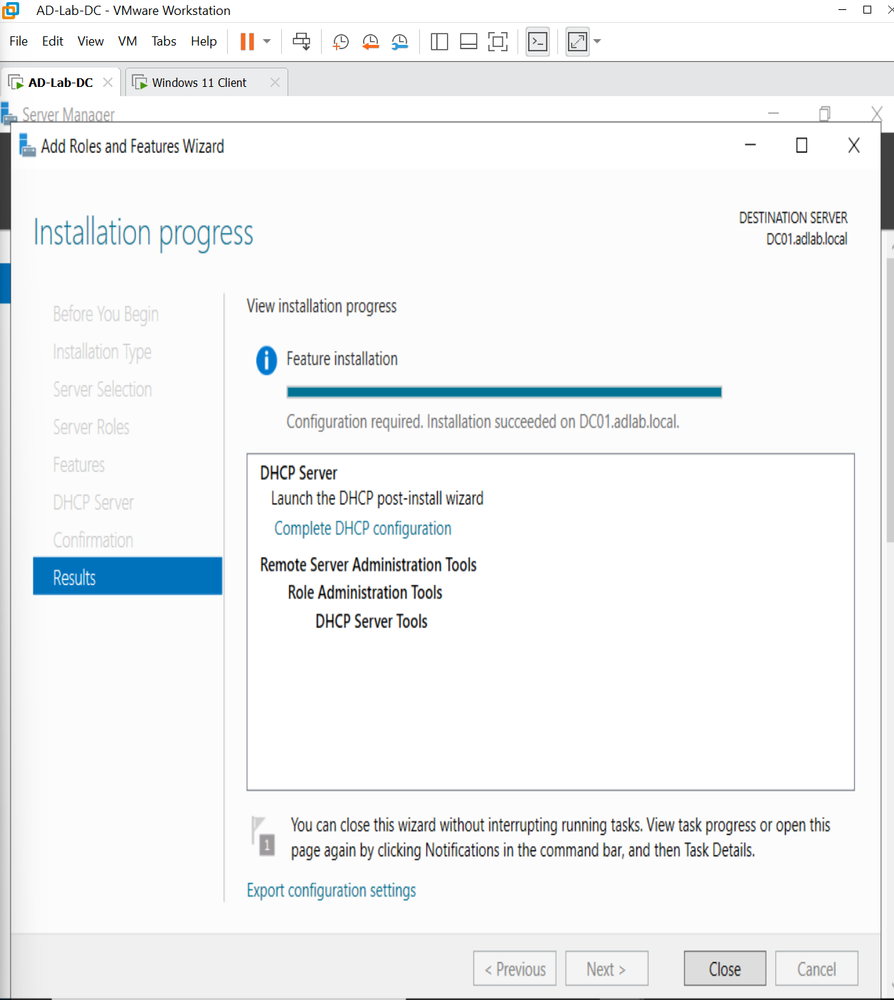

Authorized the DHCP server within Active Directory.

### Authorize DHCP Server

The DHCP server was authorized within Active Directory so that it could service DHCP requests from clients on the domain network.

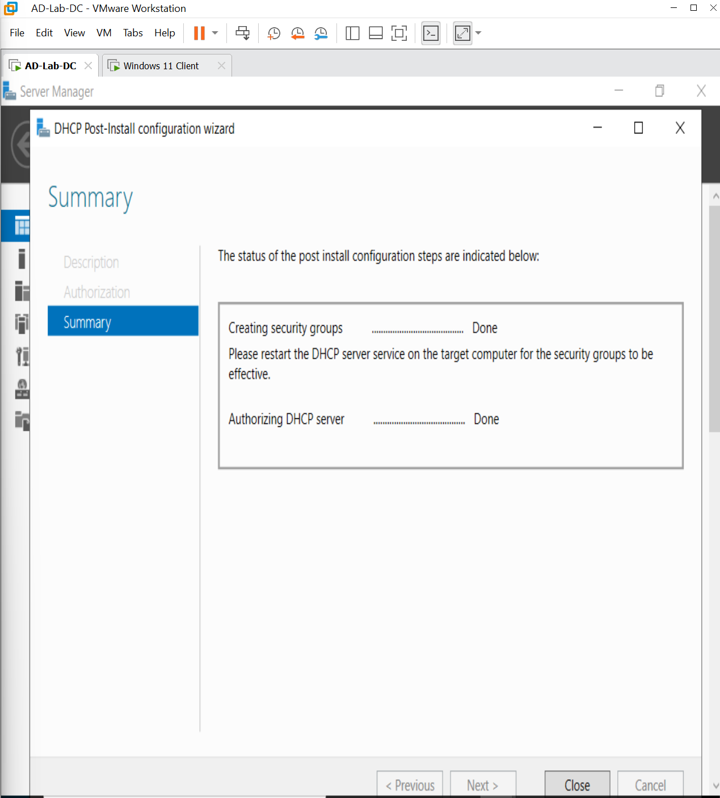

### Verify DHCP Server Role Installation

Server Manager was used to verify that the DHCP Server role had been successfully installed and was available on DC01.

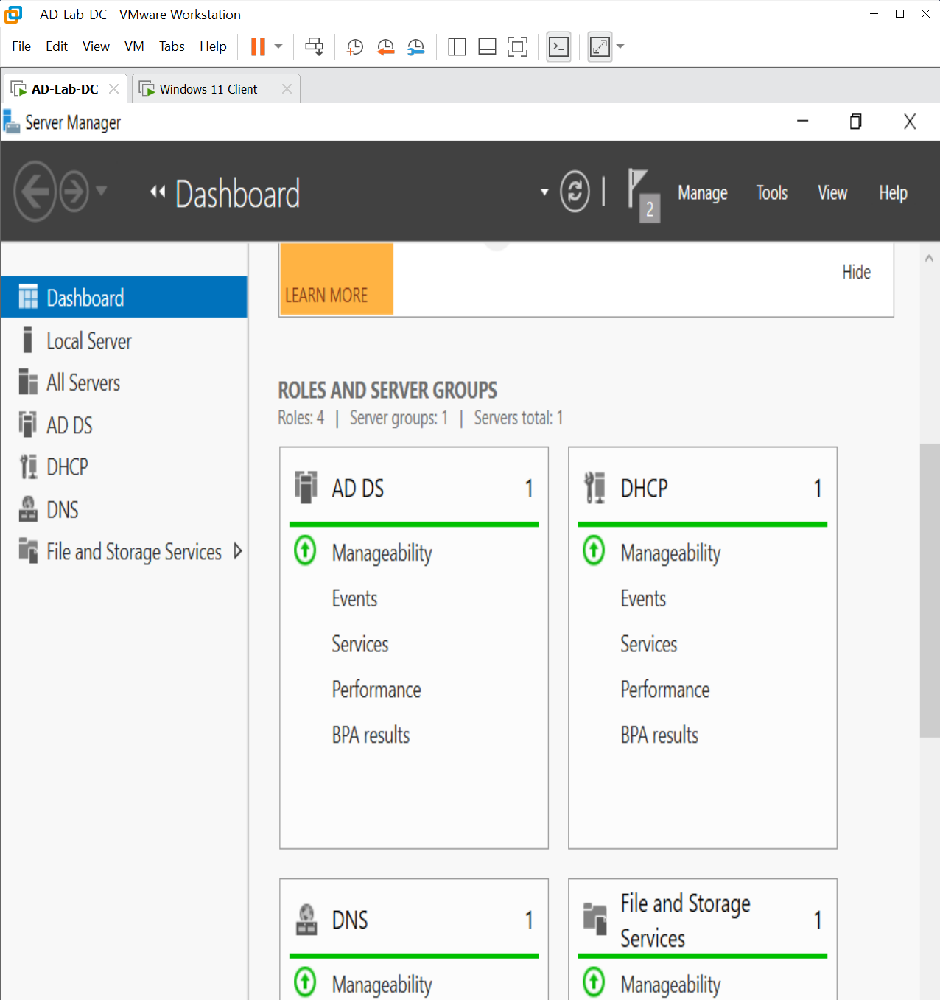

Configured and activated an IPv4 scope using the following settings:

| Setting | Value |
|---------|-------|
| Scope Name | Office Network |
| Address Range | 192.168.66.100 – 192.168.66.200 |
| Subnet Mask | 255.255.255.0 |
| DNS Server | 192.168.66.10 |
| Domain | adlab.local |

### Configure DHCP Scope

The **Office Network** IPv4 scope was configured and activated using the required address range, subnet mask, DNS server, and Active Directory domain settings.

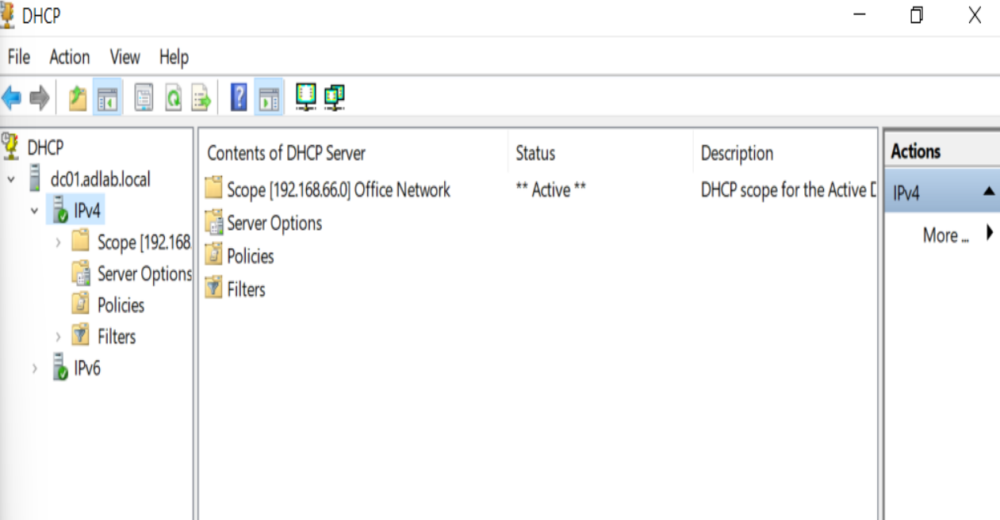

Verified that CLIENT01 successfully obtained a DHCP lease from DC01.

### Verify Client DHCP Lease

CLIENT01 successfully obtained an IP address from the configured DHCP scope.

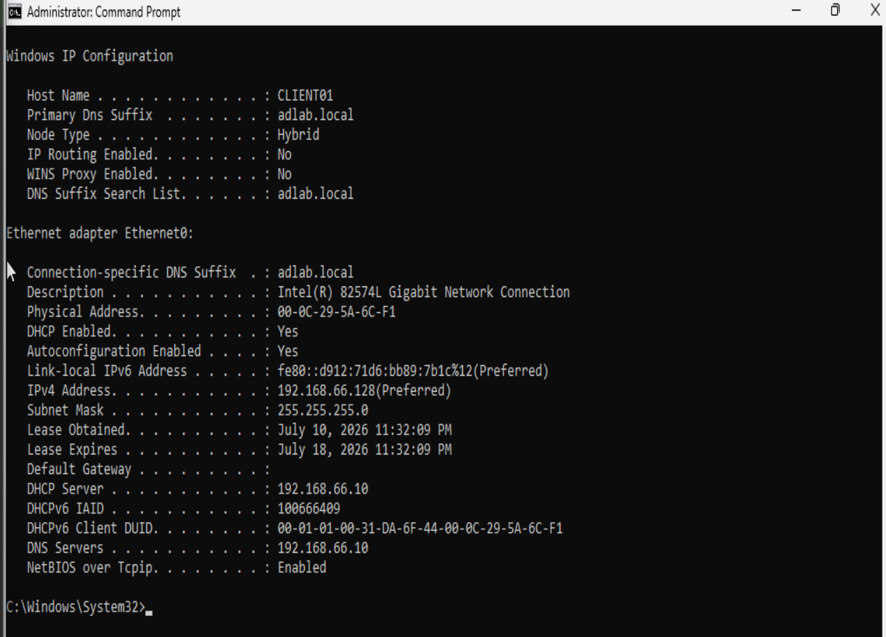

Confirmed the lease appeared within the DHCP Management Console.

### Verify Address Lease

The DHCP Management Console confirmed that the address had been leased to CLIENT01.

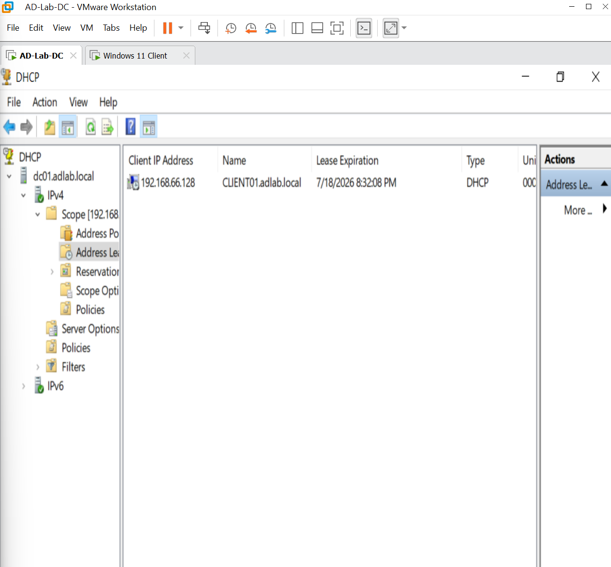

To simulate a realistic Help Desk incident, the DHCP Server service was intentionally stopped.

Observed:

- DHCP renewal failed.
- Client could not obtain a valid lease.
- Network connectivity was lost until the service was restored.

### Simulate DHCP Service Failure

The DHCP Server service was intentionally stopped to reproduce a DHCP outage and test the troubleshooting and recovery process.

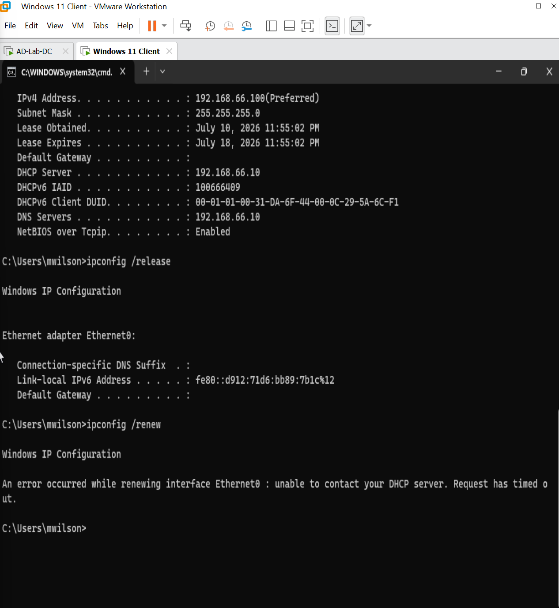

---

## Resolution

Restarted the DHCP Server service.

Confirmed the service status changed to **Running**.

### Restore DHCP Server Service

The DHCP Server service was restarted and verified as **Running**, restoring DHCP availability.

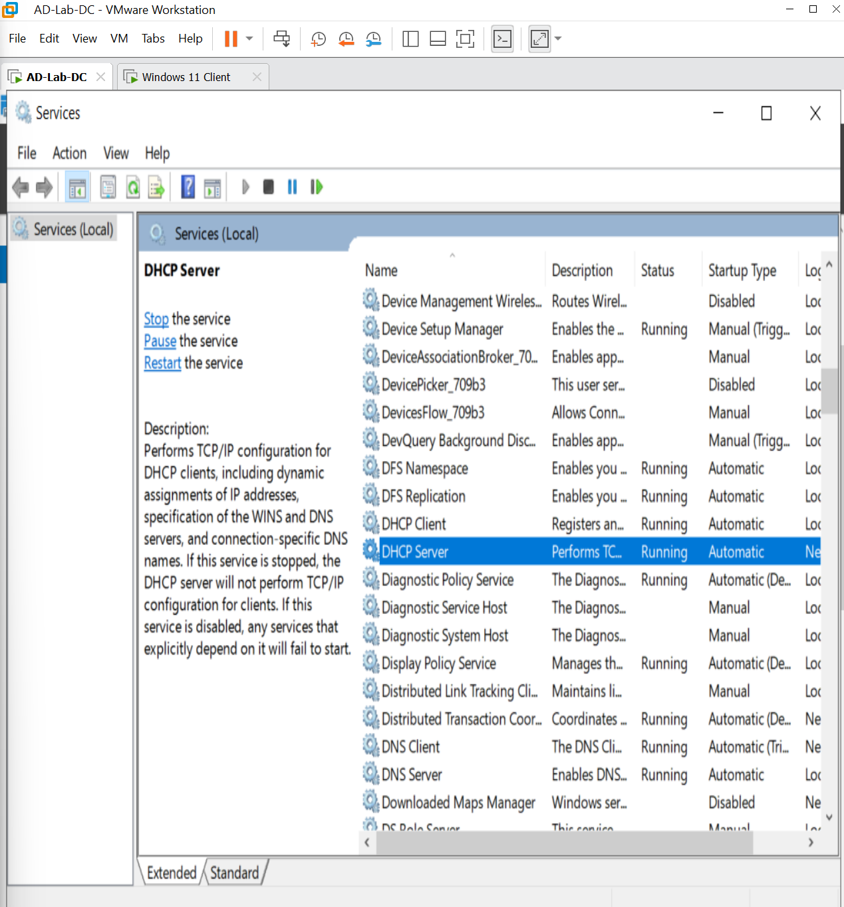

Renewed the client IP configuration.

### Recover Client DHCP Configuration

CLIENT01 renewed its network configuration after DHCP service was restored and successfully obtained a valid DHCP lease.

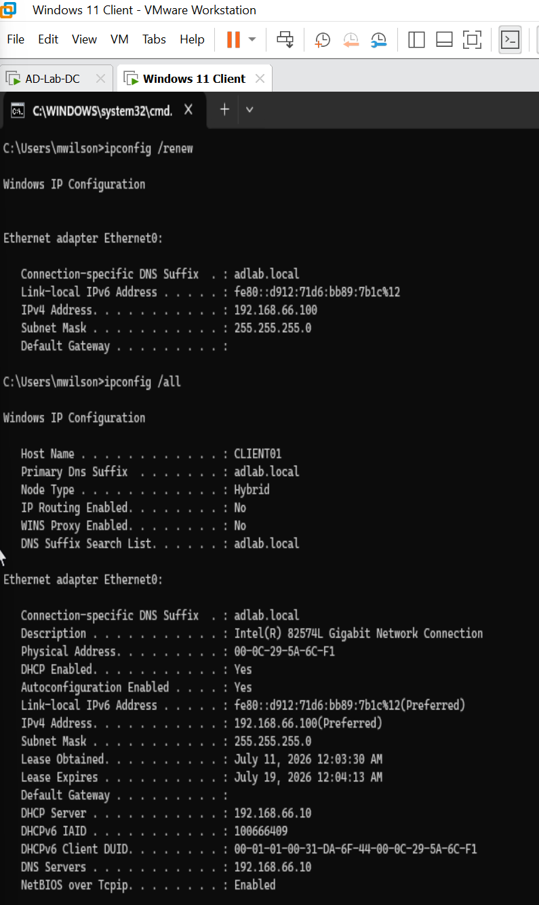

Verified:

- Client received a valid DHCP lease.
- Correct DNS server assigned.
- Network connectivity restored.
- DNS name resolution functioning normally.

Performed final connectivity testing using Command Prompt and PowerShell.

### Final DHCP Verification

Final command-line testing confirmed that DHCP addressing, DNS name resolution, and network connectivity were functioning normally after recovery.

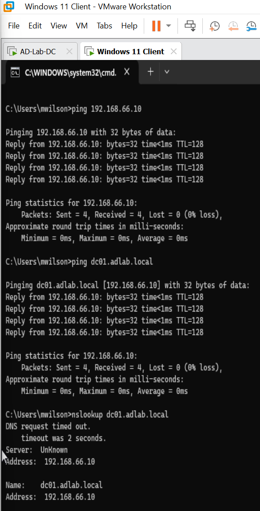

---

## Validation

Completed the following validation tests:

- ✅ DHCP Server role installed successfully
- ✅ DHCP server authorized in Active Directory
- ✅ DHCP scope created and activated
- ✅ Client successfully obtained a DHCP lease
- ✅ DHCP lease visible in the management console
- ✅ DHCP service failure successfully reproduced
- ✅ DHCP service restored successfully
- ✅ Client successfully renewed its lease
- ✅ DNS resolution verified
- ✅ Network connectivity fully restored

---

## PowerShell / Commands Used

```powershell
ipconfig /all

ipconfig /release

ipconfig /renew

ping 192.168.66.10

ping dc01.adlab.local

nslookup dc01.adlab.local

services.msc
```

---

## Result

✔ DHCP Server successfully installed and configured

✔ DHCP server authorized within Active Directory

✔ DHCP scope successfully created

✔ Client successfully received a DHCP lease

✔ DHCP service failure diagnosed and resolved

✔ Network connectivity restored

✔ DNS resolution verified

✔ Ticket resolved successfully

---

## Lessons Learned

- Installed and authorized the DHCP Server role in Active Directory.
- Configured and activated an IPv4 DHCP scope.
- Verified client lease assignment using both graphical tools and command-line utilities.
- Simulated a DHCP service outage to practice enterprise troubleshooting.
- Restored DHCP functionality and validated full client network connectivity.
- Reinforced the importance of verifying both IP addressing and DNS functionality after resolving network service issues.

---