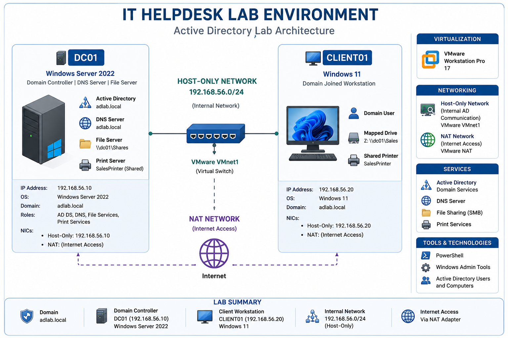
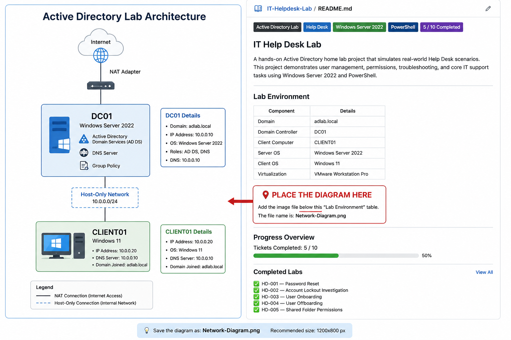

# IT Helpdesk Lab


---

# Overview

This repository documents realistic IT Help Desk scenarios performed within a Windows Server 2022 Active Directory lab environment.

Each ticket simulates a real-world Help Desk request and includes:

- Step-by-step resolution
- Active Directory administration
- PowerShell commands
- GUI administration
- Troubleshooting process
- Screenshots
- Documentation

The objective is to demonstrate practical Help Desk and Windows Server administration skills commonly used in enterprise environments.

---

## Lab Preview



---

# Objectives

- Simulate realistic Help Desk support tickets
- Perform common Active Directory administrative tasks
- Develop Windows Server administration skills
- Practice PowerShell administration
- Document troubleshooting procedures
- Build a professional GitHub portfolio
- Develop repeatable IT support workflows

---

# Lab Environment

| Component | Details |
|-----------|---------|
| Domain | adlab.local |
| Domain Controller | DC01 |
| Client Computer | CLIENT01 |
| Server OS | Windows Server 2022 |
| Client OS | Windows 11 |
| Virtualization | VMware Workstation Pro |

---

# Lab Architecture



This diagram illustrates the virtual lab environment used throughout this repository. DC01 functions as the Domain Controller, DNS Server, and file server, while CLIENT01 is a domain-joined Windows 11 workstation used to simulate end-user support scenarios. VMware Workstation Pro provides virtualization using a Host-Only network for Active Directory communication and a NAT adapter for Internet access.

---

# Technologies Used

- Windows Server 2022
- Windows 11
- Active Directory Domain Services (AD DS)
- DNS
- SMB File Sharing
- NTFS Permissions
- Group Policy
- PowerShell
- VMware Workstation Pro
- Git
- GitHub

---

# Skills Demonstrated

- Active Directory Administration
- User Account Management
- User Lifecycle Management
- Password Management
- Account Lockout Investigation
- Security Group Administration
- Shared Folder Administration
- NTFS Permissions Management
- Network Drive Mapping
- SMB Share Permissions
- Group Policy Administration
- DNS Administration
- PowerShell Automation
- Help Desk Troubleshooting
- Windows Authentication
- Technical Documentation
- Version Control with Git

---

# Progress

**Project Completion:** **8 / 10 Help Desk Scenarios Completed**

Current technologies demonstrated:

✅ Windows Server 2022
✅ Active Directory Users and Computers (ADUC)
✅ Active Directory User Management
✅ Group Policy
✅ PowerShell Administration
✅ Password Reset Procedures
✅ Account Lockout Policy
✅ Security Groups
✅ SMB File Sharing
✅ Shared Folder Administration
✅ NTFS Permissions
✅ Network Drive Mapping
✅ Printer Deployment
✅ Documentation & Screenshot Evidence
---

# Completed Labs

- ✅ HD-001 — Password Reset
- ✅ HD-002 — Account Lockout Investigation
- ✅ HD-003 — User Onboarding
- ✅ HD-004 — User Offboarding
- ✅ HD-005 — Shared Folder Permissions
- ✅ HD-006 — NTFS Permissions
- ✅ HD-007 — Network Drive Mapping
- ✅ HD-008 — Printer Deployment

---

# Upcoming Labs

- ⬜ HD-009 — DNS Troubleshooting
- ⬜ HD-010 — DHCP Troubleshooting

---

# Repository Structure

```text
IT-Helpdesk-Lab
│
├── README.md
│
├── Documentation
│   ├── Commands-Used.md
│   ├── HelpDesk-Tickets.md
│   ├── HD-001-Password-Reset.md
│   ├── HD-002-Account-Lockout.md
│   ├── HD-003-User-Onboarding.md
│   ├── HD-004-User-Offboarding.md
│   ├── HD-005-Shared-Folder-Permissions.md
│   ├── HD-006-NTFS-Permissions.md
│   ├── HD-007-Network-Drive-Mapping.md
│   ├── HD-008-Printer-Deployment.md
│   ├── HD-009-DNS-Troubleshooting.md
│   └── HD-010-DHCP-Troubleshooting.md
│
└── Screenshots
    ├── HD-001
    ├── HD-002
    ├── HD-003
    ├── HD-004
    ├── HD-005
    ├── HD-006
    ├── HD-007
    ├── HD-008
    ├── HD-009
    └── HD-010
```

---

# Documentation

Each Help Desk ticket includes:

- Ticket Objective
- Ticket Information
- Scenario
- Environment
- Investigation
- Resolution
- Verification
- PowerShell Commands
- Screenshots
- Lessons Learned

---

# Resume Relevance

This project demonstrates practical experience applicable to:

- IT Support Technician
- Help Desk Analyst
- Service Desk Technician
- Desktop Support Technician
- Junior Systems Administrator
- Windows Administrator
- Junior Network Administrator

---

# Future Enhancements

Future projects may include:

- Microsoft 365 Administration
- Exchange Administration
- BitLocker Recovery
- Windows Deployment Services (WDS)
- Windows Server Update Services (WSUS)
- Group Policy Troubleshooting
- Remote Desktop Services
- File Server Administration
- Print Server Administration
- Microsoft Intune

---

# Author

**Austin Maggs**

GitHub: <https://github.com/Amaggs99>