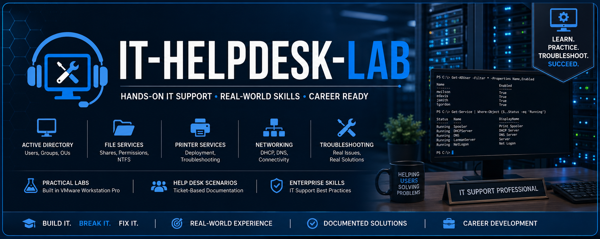

# IT Helpdesk Lab


> A professional Windows Server 2022 Help Desk portfolio featuring ten documented enterprise support scenarios completed in an Active Directory home lab.

---

## Overview

This repository documents realistic IT Help Desk scenarios performed within a Windows Server 2022 Active Directory lab environment.

Each ticket simulates a real-world Help Desk request and includes:

- Step-by-step resolution
- Active Directory administration
- PowerShell commands
- GUI administration
- Troubleshooting process
- Screenshots
- Documentation

The primary goal of this repository is to demonstrate practical Help Desk troubleshooting, Windows Server administration, and PowerShell automation skills using documented, repeatable workflows that mirror real enterprise IT environments.

---

## Repository Preview


---

## Project Objectives

- Simulate realistic Help Desk support tickets
- Perform common Active Directory administrative tasks
- Develop Windows Server administration skills
- Practice PowerShell automation and administration
- Document troubleshooting procedures
- Build a professional GitHub portfolio
- Develop repeatable IT support workflows

---

## Lab Architecture


> **Enterprise Lab Topology:** DC01 provides centralized identity, DNS, DHCP, Group Policy, file sharing, and print services for a domain-joined Windows 11 client.

This diagram illustrates the enterprise Active Directory environment used throughout this repository.

The lab consists of a Windows Server 2022 Domain Controller (DC01) providing:

- Active Directory Domain Services (AD DS)
- DNS
- DHCP
- Group Policy
- SMB File Sharing
- Print Services

CLIENT01 is a Windows 11 workstation joined to the **adlab.local** domain and is used to simulate realistic Help Desk support scenarios.

The environment is hosted in VMware Workstation Pro using:

- Host-Only networking for internal Active Directory communication
- NAT networking for Internet connectivity

---

## Lab Environment

| Component | Details |
|-----------|---------|
| Domain | adlab.local |
| Domain Controller | DC01 |
| Client Computer | CLIENT01 |
| Server OS | Windows Server 2022 |
| Client OS | Windows 11 |
| DNS | 192.168.66.10 |
| DHCP Scope | 192.168.66.100 - 192.168.66.200 |
| Virtualization | VMware Workstation Pro |

---

## Networking

| Setting | Value |
|----------|-------|
| Internal Network | 192.168.66.0/24 |
| Domain Controller | 192.168.66.10 |
| DHCP Scope | 192.168.66.100 - 192.168.66.200 |
| DNS Server | 192.168.66.10 |
| Internal Adapter | VMnet1 (Host-Only) |
| Internet Adapter | NAT |
| Virtualization | VMware Workstation Pro |

---

## Technologies Used

- Windows Server 2022
- Windows 11
- Active Directory Domain Services (AD DS)
- DHCP Server
- DNS
- SMB File Sharing
- NTFS Permissions
- Group Policy
- PowerShell
- VMware Workstation Pro
- Git
- GitHub

---

## Skills Demonstrated

- Active Directory Administration
- User Account Management
- User Lifecycle Management
- Password Management
- Account Lockout Investigation
- Security Group Administration
- Shared Folder Administration
- NTFS Permissions Management
- Network Drive Mapping
- Printer Administration
- SMB Share Permissions
- Group Policy Administration
- DNS Administration
- DHCP Configuration
- DHCP Scope Management
- DHCP Lease Troubleshooting
- PowerShell Automation
- Help Desk Troubleshooting
- Windows Authentication
- Technical Documentation
- Version Control with Git

---

## Progress

**Project Completion:** **10 / 10 Help Desk Scenarios Completed**

Current technologies demonstrated:

- ✅ Windows Server 2022
- ✅ Active Directory Users and Computers (ADUC)
- ✅ Active Directory User Management
- ✅ Group Policy
- ✅ PowerShell Administration
- ✅ Password Reset Procedures
- ✅ Account Lockout Policy
- ✅ Security Groups
- ✅ SMB File Sharing
- ✅ Shared Folder Administration
- ✅ NTFS Permissions
- ✅ Network Drive Mapping
- ✅ Printer Deployment
- ✅ Documentation & Screenshot Evidence
- ✅ DNS Troubleshooting
- ✅ DHCP Server Administration
- ✅ DHCP Scope Configuration
- ✅ DHCP Troubleshooting

---

## Completed Labs

- ✅ HD-001 — Password Reset
- ✅ HD-002 — Account Lockout Investigation
- ✅ HD-003 — User Onboarding
- ✅ HD-004 — User Offboarding
- ✅ HD-005 — Shared Folder Permissions
- ✅ HD-006 — NTFS Permissions
- ✅ HD-007 — Network Drive Mapping
- ✅ HD-008 — Printer Deployment
- ✅ HD-009 — DNS Resolution Troubleshooting
- ✅ HD-010 — DHCP Troubleshooting

---

## Repository Structure

```text
IT-Helpdesk-Lab
│
├── README.md
│
├── Documentation
│   ├── Commands-Used.md
│   ├── HelpDesk-Tickets.md
│   ├── HD-001-Password-Reset.md
│   ├── HD-002-Account-Lockout.md
│   ├── HD-003-User-Onboarding.md
│   ├── HD-004-User-Offboarding.md
│   ├── HD-005-Shared-Folder-Permissions.md
│   ├── HD-006-NTFS-Permissions.md
│   ├── HD-007-Network-Drive-Mapping.md
│   ├── HD-008-Printer-Deployment.md
│   ├── HD-009-DNS-Troubleshooting.md
│   └── HD-010-DHCP-Troubleshooting.md
│
└── Screenshots
    ├── HD-001
    ├── HD-002
    ├── HD-003
    ├── HD-004
    ├── HD-005
    ├── HD-006
    ├── HD-007
    ├── HD-008
    ├── HD-009
    └── HD-010
```

---

## Documentation

📋 **[View the Complete Help Desk Ticket Tracker](Documentation/HelpDesk-Tickets.md)**

Each Help Desk ticket includes:

- Ticket Objective
- Ticket Information
- Scenario
- Environment
- Investigation
- Resolution
- Verification
- PowerShell Commands
- Screenshots
- Lessons Learned

---

## Target Roles

This project demonstrates practical skills applicable to:

- IT Support Technician
- Help Desk Analyst
- Desktop Support Technician
- Technical Support Specialist
- Junior Systems Administrator
- Windows Administrator
- Junior Network Administrator

---

## Future Enhancements

Future projects may include:

- Microsoft 365 Administration
- Exchange Administration
- BitLocker Recovery
- Windows Deployment Services (WDS)
- Windows Server Update Services (WSUS)
- Group Policy Troubleshooting
- Remote Desktop Services
- File Server Administration
- Print Server Administration
- Microsoft Intune

---

## Author

**Austin Maggs**

Entry-Level IT Support Specialist

Sheridan College Graduate | Windows Server | Active Directory | PowerShell | Networking

- GitHub: https://github.com/Amaggs99
- LinkedIn: https://linkedin.com/in/austin-maggs